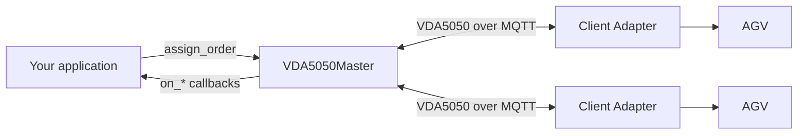

# VDA5050 Master

> ## ⚠️ Experimental
>
> The master is **experimental**. The API is still taking shape and will change
> in future releases.
>
> It is ready for evaluation and prototyping. If you build against it now,
> expect to update your code as the API settles.
>
> Constructing a master logs this same warning once.

This guide explains how to build a master on top of `vda5050_core::master`. It
is the counterpart to the client adapter
([`client-adapter.md`](client-adapter.md)): the adapter runs *on* a vehicle and
answers orders; the master runs on the fleet-control host and *issues* them.

Two companion documents: [`master-api.md`](master-api.md) is the reference for
every command and callback, and [`validation.md`](validation.md) explains what
is checked before a message is published, and why one gets rejected.

## What it does

`VDA5050Master` owns the VDA5050 conversation with every AGV in the fleet, so
your application can work in orders and events rather than protocol messages.

- **Onboards AGVs** and subscribes to their topics, one `AGV` object each
- **Validates and queues** outbound orders and instant actions, per AGV
- **Stitches order updates** into the active order
- **Tracks order lifecycle** — which node was reached, when an order completes
- **Monitors heartbeats** and reports connection and state timeouts
- **Surfaces events** so your code reacts instead of polling



### Table of Contents

- [1. Start from the Existing Example](#1-start-from-the-existing-example)
- [2. Build and Run the Packaged Example](#2-build-and-run-the-packaged-example)
  - [Send a command yourself](#send-a-command-yourself)
- [3. Create Your Own Master](#3-create-your-own-master)
  - [Where your code goes](#where-your-code-goes)
  - [3.1 Change the Broker Configuration](#31-change-the-broker-configuration)
  - [3.2 Onboard Your AGVs](#32-onboard-your-agvs)
  - [3.3 Load Your Layout](#33-load-your-layout)
  - [3.4 Build and Assign Orders](#34-build-and-assign-orders)
  - [3.5 React to AGV Events](#35-react-to-agv-events)
  - [3.6 Dispatch on Completion](#36-dispatch-on-completion)
  - [3.7 Handle Disconnection and Recovery](#37-handle-disconnection-and-recovery)
  - [3.8 Send Instant Actions](#38-send-instant-actions)
  - [3.9 Scale to Multiple AGVs](#39-scale-to-multiple-agvs)
  - [3.10 Update CMake](#310-update-cmake)
- [4. What the Master Validates](#4-what-the-master-validates)
  - [Orders](#orders)
  - [Instant actions](#instant-actions)
  - [Reading a rejection](#reading-a-rejection)
- [5. Build and Test Your Master](#5-build-and-test-your-master)
- [6. Summary of Required Changes](#6-summary-of-required-changes)

## 1. Start from the Existing Example

Use this file as your starting template:

```
vda5050_core/examples/master/master_example.cpp
```

It is a complete, runnable master for one AGV. Paired with the client adapter
example (`examples/client/adapter_example.cpp`) it drives a full order cycle,
so you can watch the protocol work before writing anything. It handles:

- broker connection and shutdown,
- onboarding an AGV and subscribing to its topics,
- requesting a factsheet and a state update on connect,
- localizing the AGV with an `initPosition`,
- building and assigning orders,
- reacting to progress, faults, and disconnects.

It runs without a layout, so route checks are limited to whether the AGV is on
the first node. Node ids are just strings at that point: the example invents
`N0` and `N1`, and the adapter example drives to whatever it is told. The one
thing that must line up is the `initPosition` node and the order's first node —
both are `N0` here. Section 3.3 covers loading a real layout, after which node
ids are checked against it.

## 2. Build and Run the Packaged Example

```bash
colcon build --packages-select vda5050_core
source install/setup.bash
```

The example needs an MQTT broker on `localhost:1883`:

```bash
mosquitto
```

Run it on its own to see it connect, onboard, and wait:

```bash
./build/vda5050_core/master_example
```

```
[WARN]: VDA5050Master API is experimental; public interfaces may change ...
[INFO]: MQTT client [master_example] connected to tcp://localhost:1883
[INFO]: Onboarded AGV [Manufacturer/S001]
[INFO]: Connected; waiting for [Manufacturer/S001] ...
```

It then sits idle: no AGV is publishing, so there is nothing to drive. On
shutdown you will see a few `MQTT unsubscription failed: Disconnected` errors —
the client is already closed by then, and they are harmless.

To watch a full order cycle you need something on the other end. The client
adapter example uses the same identity (`uagv` / `Manufacturer` / `S001`), so
the two pair up without configuration — run the adapter first, then the master:

```bash
./build/vda5050_core/adapter_example    # terminal 1
./build/vda5050_core/master_example     # terminal 2
```

Stop either with `Ctrl+C`. The full run goes:

1. Connects to the broker and onboards the vehicle
2. On connect, requests its factsheet and a state update
3. On the first State, sends an `initPosition` if it is not localized
4. Once localized, assigns an order routing `N0` to `N1`
5. On completion, assigns the reverse route — and repeats

Step 5 repeats **indefinitely** by default. One constant bounds it:

```cpp
// 0 = assign the next order on every completion indefinitely; set > 0 to stop
// after N orders instead.
constexpr int kMaxOrders = 0;
```

Set `kMaxOrders` to `5` and it stops after five orders. Leave it at `0` and it
runs until you `Ctrl+C`.

### Send a command yourself

Turn off the demo dispatch so nothing competes with you:

```cpp
constexpr bool kAutoDispatch = false;
```

The master still connects, onboards, and localizes the AGV — then waits. Your
commands go in the wait loop at the bottom of `main`:

```cpp
  namespace master_ns = vda5050_core::master;

  bool order_sent = false;

  while (running)
  {
    std::this_thread::sleep_for(std::chrono::seconds(1));
    if (order_sent) continue;

    // Wait until the AGV is onboarded, online, and localized.
    auto agv = master->get_agv(kManufacturer, kSerial);
    if (!agv || agv->get_operational_state() != master_ns::AGVState::AVAILABLE)
    {
      continue;
    }

    auto res = master->assign_order(
      kManufacturer, kSerial, make_order("my-order-1", "N0", "N1"));

    if (res.decision == master_ns::OrderAssignmentDecision::ASSIGNED)
    {
      VDA5050_INFO("order assigned");
      order_sent = true;
    }
    else
    {
      for (const auto& e : res.errors)
      {
        VDA5050_WARN("rejected: {}", e.error_description.value_or(""));
      }
    }
  }
```

Instant actions work the same way — `initPosition` to place the AGV,
`stateRequest` to make it report, `cancelOrder` to stop it:

```cpp
  types::InstantActions ia;
  ia.actions = {ActionFactory::build_init_position(
    ActionFactory::generate_action_id(), 2.0, 1.0, 0.0, kMapId, "N0")};
  master->assign_instant_actions(kManufacturer, kSerial, ia);
```

Worth trying deliberately: assign an order **before** the AGV has localized.
The pre-flight gate stops it and tells you why:

```
[WARN]: rejected: AGV position is not initialized
```

[`master-api.md`](master-api.md) contains examples for every command and
documents each decision value; [`validation.md`](validation.md) explains the
individual checks.

## 3. Create Your Own Master

Copy `master_example.cpp` into your own package and rebuild it around your own
logic. The result is one half of the system: your master issues orders, and
each vehicle needs a VDA5050 client on the other end — either the client
adapter in this library (see [`client-adapter.md`](client-adapter.md)) or the
vendor's own VDA5050 implementation.

The demo dispatch — `make_order`, `make_node`, `next_order`, the `orders_sent`
/ `first_order_sent` counters, and the `kAutoDispatch` / `kMaxOrders` constants
with their guards — all goes once your own logic replaces it. The sections
below replace it piece by piece; delete what is left over at the end.

Everything else is real and stays: the broker setup, `initPosition` on the
first State, and the callback registrations.

### Where your code goes

Your code talks to the master in two directions: **you call it** to drive the
fleet, and **it calls you** when an AGV reports something.
[`master-api.md`](master-api.md) lists every command and callback.

#### What calls you

**Your fleet logic lives in callbacks you register before connecting.**

```cpp
auto mqtt = vda5050_core::transport::create_default_client_shared(
  "tcp://localhost:1883", "my_master");
auto master = VDA5050Master::make(mqtt);

master->on_order_complete(
  [&](const std::string& agv_id, const std::string& order_id) {
    // your code: assign the next task for this AGV
    auto next = task_queue.pop_for(agv_id);
    master->assign_order(next.manufacturer, next.serial, next.order);
  });

master->on_offline([&](const std::string& agv_id) {
  // your code: take the robot out of service
  fleet_state.mark_unavailable(agv_id);
});

// Callbacks that carry more than an id follow the same shape.
master->on_mode_changed(
  [&](const std::string& agv_id, types::OperatingMode now,
      types::OperatingMode before) {
    // your code: leaving AUTOMATIC drained this AGV's un-sent work
  });

master->on_errors_appeared(
  [&](const std::string& agv_id, const std::vector<types::Error>& errors) {
    // your code: raise operator alerts for the new errors
    operator_alerts.raise(agv_id, errors);
  });

master->connect();
master->onboard_agv("uagv", "Manufacturer", "S001");
```

Register callbacks **before** `connect()`. In the current implementation they
are invoked synchronously from the inbound message-processing path, so keep
them prompt and thread-safe — a slow callback may delay processing for other
AGVs.

What you can react to:

| Group | Callbacks | Typical use |
| --- | --- | --- |
| Raw messages | `on_state`, `on_connection`, `on_factsheet`, `on_visualization` | telemetry, dashboards |
| Order progress | `on_node_reached`, `on_order_complete` | dispatch the next task |
| Availability | `on_connect`, `on_offline`, `on_connection_broken`, `on_state_timeout`, `on_state_resumed` | mark robots in and out of service |
| Faults | `on_errors_appeared`, `on_errors_resolved`, `on_mode_changed`, `on_paused`, `on_driving` | operator alerts, recovery |
| Load | `on_loads_changed` | track what a robot is carrying |
| Broker | `on_broker_disconnected`, `on_broker_reconnected` | fleet-wide degradation |

Each callback receives the `agv_id` (`manufacturer/serial`) as its first
argument, so one handler serves the whole fleet.
[`master-api.md`](master-api.md) has a registration template for every one.

Registering the same callback twice replaces the first — there is one slot per
event, not a subscriber list.

### 3.1 Change the Broker Configuration

**In the example:** the constants at the top of the file, and the
`create_default_client_shared` call in `main`.

Replace the connection constants:

```cpp
constexpr auto kBroker = "tcp://localhost:1883";
```

The second argument to `create_default_client_shared` is the MQTT client id. It
must be unique on the broker — a duplicate id causes the broker to disconnect
the older session, and two masters sharing one id will disconnect each other in
a loop.

```cpp
auto mqtt = vda5050_core::transport::create_default_client_shared(
  kBroker, "my_master");
```

### 3.2 Onboard Your AGVs

**In the example:** the `onboard_agv` call in `main`, just after `connect()`.

The example onboards one vehicle from constants:

```cpp
master->onboard_agv(kInterface, kManufacturer, kSerial);
```

Replace this with your roster. Onboarding is what makes the master subscribe to
an AGV's topics; until then its messages are ignored.

```cpp
// your code: roster is yours — a config file, a database, a ROS 2 topic
for (const auto& agv : roster)
{
  master->onboard_agv(agv.interface_name, agv.manufacturer, agv.serial);
}
```

For a roster known up front, `onboard_agv_batch` takes them all under one lock
and reports which were newly onboarded, already present, or invalid.

`offboard_agv` stops the AGV's worker and drops its subscriptions.

### 3.3 Load Your Layout

**In the example:** add to `main` after `make`, before `connect()`.

The example runs without a layout, so route checks are limited to whether the
AGV is on the first node. Loading one enables node and edge existence, map id,
and edge direction checks:

```cpp
  auto master = VDA5050Master::make(mqtt);

  auto result = master->load_layout_from_config("layout.json");
  if (!result)
  {
    // your code: report result.errors (each has .type and .description)
    // and decide whether to carry on
  }

  master->connect();
```

If the load fails, the master logs the error and keeps running **without** a
layout — the graph stays unset. Orders may still be published, but
layout-based node and edge checks are skipped. Handle the failure if that is
not what you want.

`examples/master/sample_layout.json` is a minimal LIF file to try this with. It
defines `N0` and `N1` on map `map_1` with an edge between them — the same nodes
the example already drives — so loading it changes nothing about the run except
that the layout checks now apply:

```cpp
master->load_layout_from_config("examples/master/sample_layout.json");
```

Assign an order to a node that is not in it and you get
`Order node_id 'X' is not present in the master's loaded layout.`

Skip this only if your orders reference nodes you have already validated
elsewhere. See [`validation.md`](validation.md) for what each check covers.

### 3.4 Build and Assign Orders

**In the example:** the `make_order` helper above `main`, and wherever you
decide to assign — a callback, or the wait loop at the bottom of `main`.

The example builds a fixed two-node route:

```cpp
types::Order make_order(
  const std::string& order_id, const std::string& from, const std::string& to)
```

Replace it with orders from your task source. The rules that matter:

- `order_id` must be unique per order; reusing one is treated as an update
- nodes take even `sequence_id`s, edges the odd ones between them
- `released: true` means the AGV may drive it; unreleased nodes are the horizon
- the master fills the VDA5050 header before publishing

Assign with `assign_order`, and check the decision — it returns `ASSIGNED` only
when the order was accepted for sending:

```cpp
auto res = master->assign_order(manufacturer, serial, order);
if (res.decision != OrderAssignmentDecision::ASSIGNED)
{
  for (const auto& e : res.errors)
  {
    // your code: report e.error_type and e.error_description
  }
}
```

A rejection here is **returned, not logged** — the master stays quiet because
only you know whether one matters. If the result is ignored, the caller
receives no other notification of that rejection.

For a newly accepted order, `assign_order` returns once it has been
**queued**. Deeper validation runs on the AGV's worker thread afterwards, and
those rejections are the other way round: logged, not returned, because there
is no caller left to tell. [Section 4](#4-what-the-master-validates) covers
both stages, and [`master-api.md`](master-api.md) lists every
`OrderAssignmentDecision` value.

To extend an order the AGV is already running, send another order with the same
`order_id` and a higher `order_update_id`. The master merges it at the stitch
point. A `STITCH_QUEUED` decision means the update is held until the AGV
confirms the previous one — it is not a failure.

### 3.5 React to AGV Events

**In the example:** the `on_*` registrations in `main`, between `make` and
`connect()`. Seven are already there; add or edit alongside them.

The example logs each event. Replace those bodies with your own state:

```cpp
  auto master = VDA5050Master::make(mqtt);

  master->on_node_reached(
    [&](const std::string& agv_id, const std::string& node_id) {
      // your code: update where you think the robot is
      fleet_state.update_position(agv_id, node_id);
    });

  master->on_errors_appeared(
    [&](const std::string& agv_id, const std::vector<types::Error>& errors) {
      // your code: raise operator alerts for the new errors
      operator_alerts.raise(agv_id, errors);
    });

  master->connect();
```

Use the table in [Where your code goes](#where-your-code-goes) to pick the
callback. Two worth wiring early:

- `on_state_timeout` — the AGV stopped reporting; orders will be rejected until
  `on_state_resumed` fires
- `on_mode_changed` — a vehicle leaving master control drains its queues to a
  buffer you can resume or discard

### 3.6 Dispatch on Completion

**In the example:** the `on_order_complete` registration in `main`.

The example loops between two nodes forever:

```cpp
master->on_order_complete(
  [&](const std::string& agv_id, const std::string& order_id) {
    // your code: pick and assign the next task for this AGV
    next_order();
  });
```

This is where your scheduler goes. `on_order_complete` fires when the AGV has
reached the order's last node and all its actions are terminal.

In this version of the master it does **not** fire for an order rejected after
`assign_order` returned — that appears in the log only. If this callback is the
only thing that assigns work, a rejected order leaves the AGV idle with nothing
to restart it. Give your scheduler a second trigger — a timer, a task queue,
anything that can assign without waiting for a completion. A rejection callback
is planned.

### 3.7 Handle Disconnection and Recovery

**In the example:** the `on_connection_broken` and `on_connect` registrations
in `main`.

The example logs disconnects. A real master needs to decide what happens
to the work:

```cpp
  auto master = VDA5050Master::make(mqtt);

  master->on_connection_broken([&](const std::string& agv_id) {
    // your code: the AGV dropped without warning and its queued orders are
    // cancelled, so put that work back on the schedule
    scheduler.requeue_tasks_for(agv_id);
  });

  master->on_connect([&](const std::string& agv_id) {
    // your code: re-run setup, it may have restarted and lost its position
  });

  master->connect();
```

`on_broker_disconnected` and `on_broker_reconnected` cover the master's own
connection. Queued orders survive a broker drop and publish on reconnect.

### 3.8 Send Instant Actions

**In the example:** the `send_action` helper above `main`, called from a
callback or the wait loop.

Instant actions are the out-of-band channel: `cancelOrder`, `startPause`,
`initPosition`, `stateRequest`. They are validated more loosely than orders so
they still work when a vehicle is degraded.

```cpp
types::InstantActions ia;
ia.actions = {ActionFactory::build_init_position(
  ActionFactory::generate_action_id(), x, y, theta, map_id, node_id)};
master->assign_instant_actions(manufacturer, serial, ia);
```

`ActionFactory` builds the predefined types. Every `action_id` must be unique
against actions still running, in the active order, or queued — reusing one is
rejected.

### 3.9 Scale to Multiple AGVs

**In the example:** the three state flags declared at the top of `main`, and
every callback that touches them.

The example is single-AGV: it tracks `init_sent` and `first_order_sent` as plain
`bool`s because there is only one vehicle. With a fleet, that state has to be
keyed by `agv_id`:

```cpp
// your code: whatever you need to track per vehicle
struct RobotState
{
  bool init_sent = false;
  std::string current_order_id;
};

int main()
{
  auto master = VDA5050Master::make(mqtt);

  // Replaces the example's init_sent / first_order_sent / orders_sent.
  std::unordered_map<std::string, RobotState> fleet_state;

  master->on_state(
    [&](const std::string& agv_id, const types::State& state) {
      auto& robot = fleet_state[agv_id];
      // your code: this AGV's state, not the fleet's
    });

  master->connect();
  for (const auto& agv : roster)
  {
    master->onboard_agv(agv.interface_name, agv.manufacturer, agv.serial);
  }
```

Three things change with more than one vehicle:

- **Per-AGV state must be a map**, keyed by `agv_id`
- **Callbacks are shared** — one registered handler receives events for every
  AGV, identified by `agv_id`, so branch on it rather than registering per robot
- **Keep handlers prompt** — a slow one may delay processing for other AGVs

`get_onboarded_agvs()` returns every `{manufacturer, serial}` currently
onboarded. `get_agv()` returns a read-only view of one vehicle's cached state.

### 3.10 Update CMake

**In the example:** your own package's `CMakeLists.txt`.

Link your executable against the master library:

```cmake
find_package(vda5050_core REQUIRED)

add_executable(my_master src/my_master.cpp)
target_link_libraries(my_master
  PRIVATE
    vda5050_core::vda5050_master
    vda5050_core::vda5050_transport
)
```

## 4. What the Master Validates

The master runs its order and instant-action checks before publishing. Your
application may still apply its own business or scheduling rules before calling
it. This section is what those checks are and, more usefully, which failures
come back to you and which only reach the log.
[`validation.md`](validation.md) describes the individual validators.

Not every step is a validator. Several are inline gates on AGV or broker state.
The **Source** column says which is which.

### Orders

For a newly accepted order, `assign_order()` returns once it has been
**queued**. The rest of the chain runs afterwards on the AGV's outbound
worker, and those rejections are **logged, not returned**.

Checked before `assign_order()` returns:

| # | Check | Source | Decision on failure |
| --- | --- | --- | --- |
| 1 | AGV is onboarded | inline | `AGV_NOT_ONBOARDED` |
| 2 | connection is `ONLINE` | inline | `AGV_OFFLINE` |
| 3 | operational state is `AVAILABLE` | inline | `AGV_NOT_READY` |
| 4 | a State has been received | inline | `AGV_NO_STATE_YET` |
| 5 | master is in control | `is_master_in_control` | `AGV_MODE_NOT_AUTO` |
| 6 | position is initialized | inline | `AGV_POSITION_NOT_INITIALIZED` |
| 7 | stitch decision | `OrderStitcher` | `STITCH_REJECTED`, `STITCH_QUEUED`, `DUPLICATE_IGNORED` |
| 8 | outbound queue has room | inline | `AGV_QUEUE_FULL` |

Check 6 is the common one on first bring-up: send an `initPosition` instant
action before the first order.

Checked afterwards, on the worker thread, stopping at the first failure:

| # | Check | Source |
| --- | --- | --- |
| 1 | message content | `validate_order_content` |
| 2 | AGV readiness | `validate_pre_send` |
| 3 | graph structure | `is_valid_graph` |
| 4 | array sizes | `validate_protocol_limits` |
| 5 | route is drivable | `validate_traversability` |
| 6 | actions are supported | `validate_capability` |
| 7 | broker is connected | inline |

On a stitch, steps 3 and 4 take the **merged** order, the one the AGV ends up
holding. Steps 5 and 6 always take the incoming fragment.

> A failure in this second group has no channel back to your code. It produces
> an `ERROR` log line and nothing else, so a scheduler that assigns the next
> order from `on_order_complete` will wait forever. Until a rejection callback
> exists, pair completion-driven dispatch with a timeout.

### Instant actions

These are validated in full before `assign_instant_actions()` returns, so the
result you get back is the real one.

The readiness gate is deliberately skipped and only the connection is required.
That is what keeps `cancelOrder` usable during an error and `initPosition`
usable before the AGV is localized.

| # | Check | Source |
| --- | --- | --- |
| 1 | message has at least one action | inline |
| 2 | every `action_id` is unique | inline |
| 3 | message content | `validate_instant_actions_content` |
| 4 | AGV is `ONLINE` | inline |
| 5 | operating-mode gate | `validate_instant_action_mode` |
| 6 | actions are supported | `validate_capability` |
| 7 | no blocking conflict | `validate_action_conflict` |
| 8 | number of actions | `validate_protocol_limits` |
| 9 | broker is connected | inline |

Check 2 is the one integrators hit most. It compares against in-flight actions,
the active order, and the outbound queue as well as within the message, so
reusing an `action_id` that is still running is rejected.

### Reading a rejection

Check `decision` first. `operator bool` is `true` only for `ASSIGNED`, so a
`STITCH_QUEUED` or `DUPLICATE_IGNORED` outcome tests false. These are
non-assignment outcomes rather than validation failures, and may carry no
errors.

```cpp
auto res = master->assign_order(manufacturer, serial, order);
if (res.decision != OrderAssignmentDecision::ASSIGNED)
{
  for (const auto& e : res.errors)
  {
    VDA5050_WARN(
      "rejected: type={} desc={}", e.error_type,
      e.error_description.value_or(""));
  }
}
```

Only `PreSendValidationError` and `OrderUpdateError` can reach an
`OrderAssignmentResult`. The other error types listed in
[`validation.md`](validation.md) are raised on the worker thread and appear in
the log.

## 5. Build and Test Your Master

```bash
colcon build --packages-select my_master
source install/setup.bash
./build/my_master/my_master
```

Bring it up in stages:

1. **Connect only** — comment out onboarding. You should see the broker connect
   and nothing else.
2. **Onboard one AGV** — with a real vehicle or the adapter example running, you
   should see it come online and report state.
3. **Assign one order** — check the decision is `ASSIGNED`, then watch
   `on_node_reached` fire as it drives.
4. **Add the rest of the fleet.**

If an order is rejected before queuing, the decision value identifies the
reason. Rejections produced later by the outbound worker appear in the log.
[Section 4](#4-what-the-master-validates) maps the pre-queue decisions and the
worker-stage checks to their meaning.

Run with `DEBUG` logging to see the queue and heartbeat internals:

```cpp
vda5050_core::logger::set_log_level(vda5050_core::logger::LogLevel::DEBUG);
```

## 6. Summary of Required Changes

| # | Change | Where |
| --- | --- | --- |
| 3.1 | Broker URL and a unique client id | constants at the top |
| 3.2 | Your AGV roster instead of one hardcoded vehicle | `onboard_agv` calls |
| 3.3 | Load your layout | after `make`, before `connect` |
| 3.4 | Orders from your task source | replace `make_order` |
| 3.5 | Fleet state and alerts | callback bodies |
| 3.6 | Your scheduler | `on_order_complete` |
| 3.7 | Requeue and recovery policy | `on_connection_broken`, `on_connect` |
| 3.8 | Instant actions your fleet needs | `assign_instant_actions` |
| 3.9 | Per-AGV state keyed by `agv_id` | replace the single-robot flags |
| 3.10 | Link `vda5050_master` | your `CMakeLists.txt` |

Then delete whatever demo scaffolding is left: `make_order`, `make_node`,
`next_order`, the counters, and the `kAutoDispatch` / `kMaxOrders` constants
with their guards.
